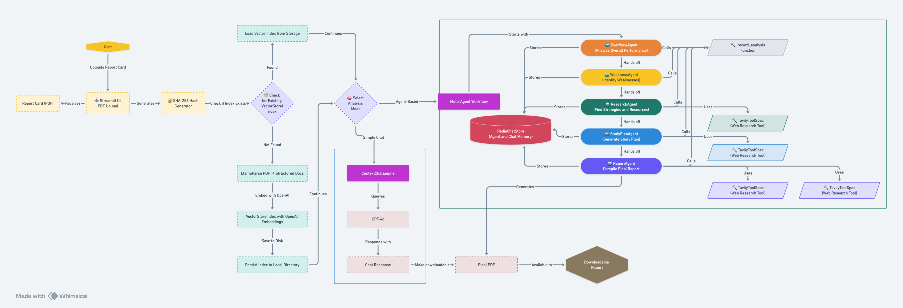

# 📊 Advanced Report Card Analysis System


A powerful Streamlit application that leverages artificial intelligence to analyze elementary school report cards, providing comprehensive insights, personalized recommendations, and actionable study plans.

## 📋 Overview

The Advanced Report Card Analysis System transforms standard PDF report cards into detailed educational insights through a sequential multi-agent workflow. The application parses report card data, identifies strengths and weaknesses, recommends targeted educational resources, and generates personalized study plans—all presented in an intuitive web interface with downloadable PDF reports.



## ✨ Key Features

- **🔄 Sequential Agent Workflow**: Five specialized AI agents work in sequence to provide comprehensive analysis
- **📤 PDF Processing**: Extract structured data from complex report card layouts with LlamaParse
- **🧠 Dual Analysis Modes**: 
  - **Simple Chat**: Quick Q&A about the report card
  - **Agent-Based**: Comprehensive multi-step analysis
- **📊 Dynamic Results Display**: Real-time visualization of agent progress and outputs
- **📑 PDF Report Generation**: Downloadable reports for each analysis stage
- **🔍 Educational Resource Finder**: Research-based learning materials using Tavily API
- **💾 Efficient Reprocessing**: Smart file hashing prevents redundant processing of the same document

## 🤖 Agent Workflow

Our system implements a sophisticated sequential workflow of specialized agents:

### 1. OverviewAgent
- Provides comprehensive performance analysis
- Extracts student information and demographics
- Analyzes core subject performance and specialty areas
- Identifies patterns in attendance and social development

### 2. WeaknessAgent
- Identifies specific areas needing improvement
- Lists standards with scores of 2 or below
- Groups findings by subject area
- Prioritizes based on frequency and potential impact

### 3. ResearchAgent
- Finds evidence-based educational resources
- Searches for age-appropriate materials
- Provides implementation strategies
- Adapts recommendations to student's learning style

### 4. StudyPlanAgent
- Creates weekly learning goals
- Designs targeted activities
- Includes progress tracking methods
- Adapts to the student's demonstrated learning style

### 5. ReportAgent
- Compiles all analyses into a comprehensive report
- Creates an executive summary
- Synthesizes insights from all previous agents
- Provides clear next steps and actionable recommendations

## 🛠️ Technology Stack

- **Frontend**: Streamlit 1.44.0
- **PDF Parsing**: LlamaParse via LlamaIndex
- **Language Models**: OpenAI GPT-4o
- **Embeddings**: OpenAI text-embedding-3-large
- **Vector Processing**: LlamaIndex VectorStoreIndex
- **Memory Management**: Redis-backed ChatMemoryBuffer
- **Research Capabilities**: Tavily API for educational resource search
- **Report Generation**: ReportLab for PDF creation
- **Workflow Orchestration**: LlamaIndex AgentWorkflow with function calling

## 🚀 Getting Started

### Prerequisites

- Python 3.13.2
- Redis server (optional, for chat memory persistence)
- API keys for OpenAI, LlamaParse, and Tavily

### Installation

1. **Clone the repository**
   ```bash
   git clone https://github.com/zacharyvunguyen/reportcard-rag-chatbot
   cd reportcard-rag-chatbot
   ```

2. **Set up a virtual environment**
   ```bash
   # Using conda (recommended)
   conda create -n reportcard-rag python=3.13
   conda activate reportcard-rag
   
   # Or using venv
   python -m venv venv
   source venv/bin/activate  # On Windows: venv\Scripts\activate
   ```

3. **Install dependencies**
   ```bash
   pip install -r requirements.txt
   ```

4. **Create `.env` file with API keys**
   ```
   OPENAI_API_KEY=your_openai_key
   LLAMA_PARSE_API_KEY=your_llamaparse_key
   TAVILY_API_KEY=your_tavily_key
   REDIS_URL=redis://localhost:6379
   EMBED_MODEL=text-embedding-3-large
   LLM_MODEL=gpt-4o
   TEMPERATURE=0.2
   CHUNK_SIZE=2048
   CHUNK_OVERLAP=128
   ```

5. **Run the application**
   ```bash
   cd demo
   streamlit run test_agent_chain_04.py
   ```

## 📁 Directory Structure

```
reportcard-rag-chatbot/
├── data/                     # Data storage
│   ├── uploads/              # Temporary PDF storage
│   └── indices/              # Vector indices (persistent)
├── demo/                     # Application scripts
│   ├── test_agent_chain_04.py # Main Streamlit application
│   └── logs/                 # Application logs
├── diagrams/                 # System architecture diagrams
├── .env                      # Environment variables
├── requirements.txt          # Python dependencies
├── AGENTS.md                 # Detailed agent documentation
└── README.md                 # This file
```

## 📋 Example Use Cases

### For Parents
- Upload your child's report card to understand strengths and weaknesses
- Receive curated educational resources tailored to your child's needs
- Get a structured study plan to support your child's academic growth
- Download comprehensive reports to track progress over time

### For Teachers
- Analyze student report cards to identify common areas for improvement
- Generate tailored study plans for individual students
- Receive evidence-based teaching resources for specific standards
- Create professional reports for parent-teacher conferences

### For Educational Researchers
- Study patterns in student performance across various standards
- Analyze the effectiveness of educational interventions
- Generate data-driven insights on curriculum development
- Create comprehensive documentation of student progress

## 🔮 Future Roadmap

- [ ] **Student Tracking**: Implement progress tracking across multiple report cards
- [ ] **Google Cloud Deployment**: Containerize for GCP Cloud Run with Firestore integration
- [ ] **Multi-User Support**: Add authentication and role-based access control
- [ ] **Dashboard Analytics**: Create visualizations of student performance metrics
- [ ] **Side-by-Side View**: Add original PDF view alongside analysis
- [ ] **Multi-Language Support**: Add capabilities for non-English report cards
- [ ] **Parallel Agent Processing**: Optimize for faster analysis where dependencies allow
- [ ] **Mobile Optimization**: Enhance mobile UI for on-the-go access

## 👨‍💻 Author

**Zachary Vu Nguyen** - AI Engineer & GenAI Systems Builder

- 🔗 [LinkedIn](https://www.linkedin.com/in/zacharyvunguyen)
- 🐙 [GitHub](https://github.com/zacharyvunguyen)

## 📄 License

This project is licensed under the MIT License - see the [LICENSE](LICENSE) file for details.

---

*Made with ❤️ using GPT-4o, LlamaIndex, and Streamlit* 